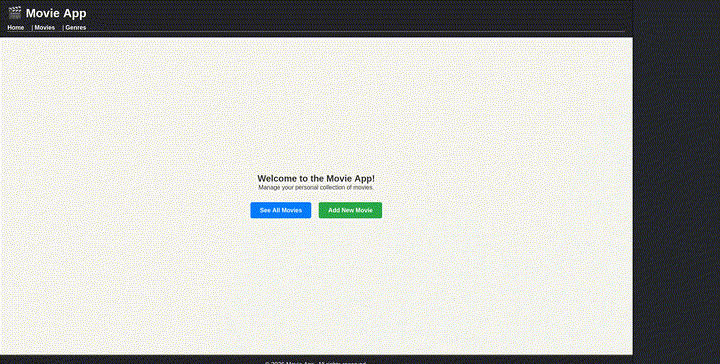
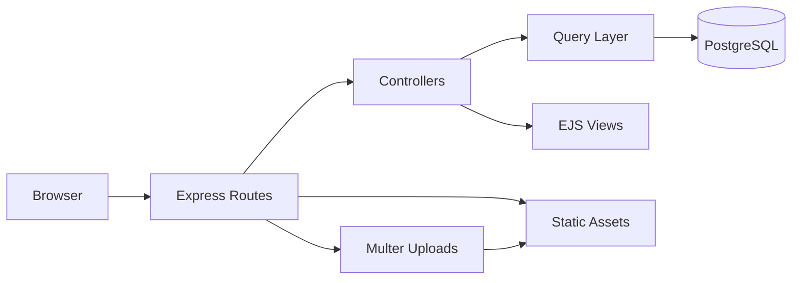
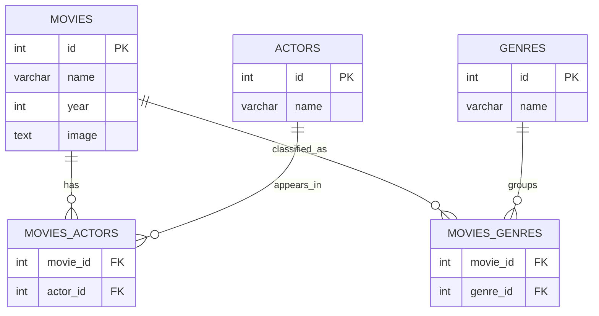
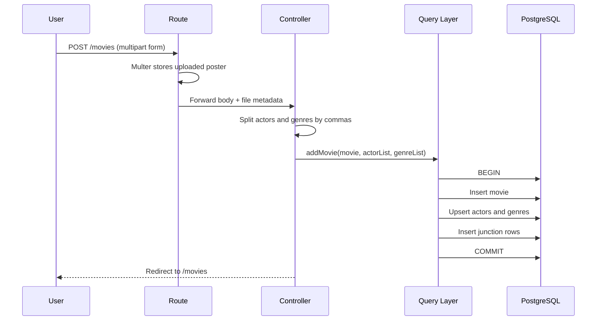

# Movie App

A server-rendered movie inventory project built with Express, EJS, PostgreSQL, and Multer. The app lets users browse a movie catalog, inspect a single movie, upload poster images, and perform the full create, update, and delete cycle while keeping actors and genres normalized in the database.

> Status: movie CRUD is implemented and working, while the `genres` area is still only partially built.
>
> Live demo: not deployed yet.
>
> Animated preview: generated from the available screenshot in `docs/` because no screen-recording video was present in the repository.

<p align="center">
  
</p>

## Overview

This project takes the classic "inventory app" brief and gives it a movie-focused domain. Instead of treating inventory as anonymous products, it models movies, actors, and genres as related entities and exposes that data through a small SSR application.

What makes it more interesting academically is that it does not stop at a flat CRUD table. It explores:

- relational schema design with many-to-many tables
- route/controller/query separation
- server-side rendering with EJS
- multipart file uploads with Multer
- transactional writes for consistent inserts and updates

## Feature Summary

- Browse all stored movies from a single catalog page
- View a single movie with poster, release year, actors, and genres
- Add a new movie with comma-separated actors and genres
- Upload a movie poster into the static image directory
- Edit existing movie metadata without losing the current poster by accident
- Delete a movie and let junction-table rows clean up through cascade rules
- Render a custom `404` page for unknown routes

## Route Coverage

| Route | Method | Purpose | Status |
| --- | --- | --- | --- |
| `/` | `GET` | Home page | Implemented |
| `/movies` | `GET` | List all movies | Implemented |
| `/movies/new` | `GET` | Add-movie form | Implemented |
| `/movies` | `POST` | Create movie and upload poster | Implemented |
| `/movies/:id` | `GET` | Single-movie details | Implemented |
| `/movies/:id/edit` | `GET` | Edit form | Implemented |
| `/movies/:id/update` | `POST` | Update movie and relations | Implemented |
| `/movies/:id/delete` | `POST` | Delete movie | Implemented |
| `/genres` | `GET` | Genre listing | Partial placeholder |

## Stack

- Backend: Node.js, Express
- Views: EJS
- Database: PostgreSQL
- Upload handling: Multer
- Styling: plain CSS
- Environment config: dotenv

## Architecture



The codebase follows a lightweight MVC-like shape:

- routes define endpoints
- controllers coordinate request handling
- database queries stay in a dedicated module
- EJS templates render the final HTML

## Database Model

The original notes planned five tables, and that design survived into the final implementation: three main entities and two junction tables.



This is one of the strongest parts of the project because it demonstrates normalization rather than storing actors and genres as loose strings inside a single movie row.

## Example Request Flow

The add-movie flow is a good example of how several concerns come together in one request:



## Project Structure

```text
.
|-- docs/
|   |-- image.png
|   `-- preview.gif
|-- src/
|   |-- app.js
|   |-- controllers/
|   |-- db/
|   |-- public/
|   |   `-- images/
|   |-- routes/
|   `-- views/
|-- package.json
`-- README.md
```

## Running Locally

1. Install dependencies.

```bash
npm install
```

2. Create a root `.env` file.

```env
DB_URL=your_postgres_connection_string
PORT=3000
```

3. Create and seed the database.

```bash
npm run pop
```

4. Start the app.

```bash
npm run dev
```

Then open `http://localhost:3000`.

## Code Snippets Worth Highlighting

Fetching movie details is done concurrently instead of one query after another:

```js
const [movie, actors, genres] = await Promise.all([
  db.getMovieById(movieId),
  db.getActorsByMovieId(movieId),
  db.getGenresByMovieId(movieId),
]);
```

Writes are wrapped in a transaction and related entities are reused with `ON CONFLICT`:

```js
await client.query('BEGIN');

const resolveId = (table, name) =>
  client.query(
    `INSERT INTO ${table} (name) VALUES ($1)
     ON CONFLICT (name) DO UPDATE SET name = EXCLUDED.name
     RETURNING id`,
    [name]
  );
```

These are small details, but they elevate the project from "basic forms app" to something much closer to real application behavior.

## What Was Learned

- How to translate a rough idea into a relational schema before writing routes
- How many-to-many relationships actually work in practice through junction tables
- How to keep Express code more maintainable by separating routes, controllers, and database queries
- How SSR with EJS can still deliver a complete CRUD experience without jumping straight into a frontend framework
- How multipart uploads work and how uploaded file paths can be stored for later rendering
- How transactions protect consistency when one movie creation depends on several related inserts

## Development Decisions Taken From the Notes

The original planning notes are visible in the project history, and they show a few good instincts that shaped the final result:

- The project started by planning the data model first, especially the five-table structure. That was the right call.
- There was an early temptation to expand the scope toward watched and to-watch features, but that was intentionally cut to avoid turning the app into a different product.
- There was also a choice between keeping the app SSR with EJS or refactoring into React later. Staying with EJS kept the project finishable and helped reinforce backend fundamentals.

That kind of scope control is part of the learning value too.

## Difficulties and Friction Points

- Designing the relationships was harder than building the homepage because the schema decisions affected every later route.
- HTML forms do not natively support `PUT` and `DELETE`, so update and delete actions were implemented through `POST` routes.
- Handling poster uploads required deciding where files should live, how they should be named, and how the saved path should be stored.
- The `genres` feature was planned more broadly than it ended up being implemented, which shows how easy it is for scope to outrun execution.
- Error handling still leans simple, especially the app-level redirect on uncaught errors.

## Optimizations and Good Practices Already Present

- `Promise.all` is used to reduce latency when reading movie details and related taxonomy data.
- Database writes use explicit transactions with `BEGIN`, `COMMIT`, and `ROLLBACK`.
- `ON CONFLICT` avoids duplicating actor and genre names.
- `COALESCE` in updates keeps the existing image when no replacement poster is uploaded.
- Junction tables use `ON DELETE CASCADE`, which simplifies cleanup after movie deletion.
- Static assets are separated cleanly under `src/public`.

## Academic Value

This project is valuable beyond the UI because it demonstrates several concepts that are foundational in full-stack education:

- normalized relational modeling
- mapping HTTP routes to application behavior
- SSR templating
- file uploads and static asset handling
- transactional integrity in SQL-backed apps
- tradeoff management between ambition and completion

In an academic or portfolio context, it shows not only that a CRUD app can be built, but that it can be structured with deliberate database design and sensible separation of concerns.

## Current Limitations

- The `genres` page is still a stub and does not yet expose full genre-based browsing
- `zod` is installed but not yet used for validation
- There is no authentication or role protection for destructive actions
- There are no automated tests yet
- There is no live deployment at the moment
- The animated preview is based on the screenshot because no demo video file existed in `docs/`

## Future Improvements

- Finish the genre browsing pages and link genres to filtered movie views
- Add server-side validation with `zod`
- Add flash/error messaging instead of redirecting all uncaught errors to `/`
- Add tests for queries and route behavior
- Add pseudo-auth or admin protection for edit and delete actions
- Deploy the application and replace the placeholder preview with a real recorded demo GIF

## Final Takeaway

This is a solid learning project because it captures a real progression: plan the schema, build the routes, connect the database, make the UI usable, and discover where polish and robustness still need work. It is small enough to understand, but rich enough to teach database design, SSR architecture, and CRUD workflow design in a meaningful way.
